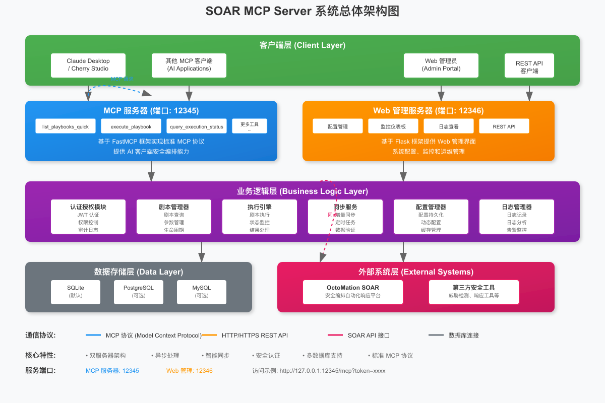
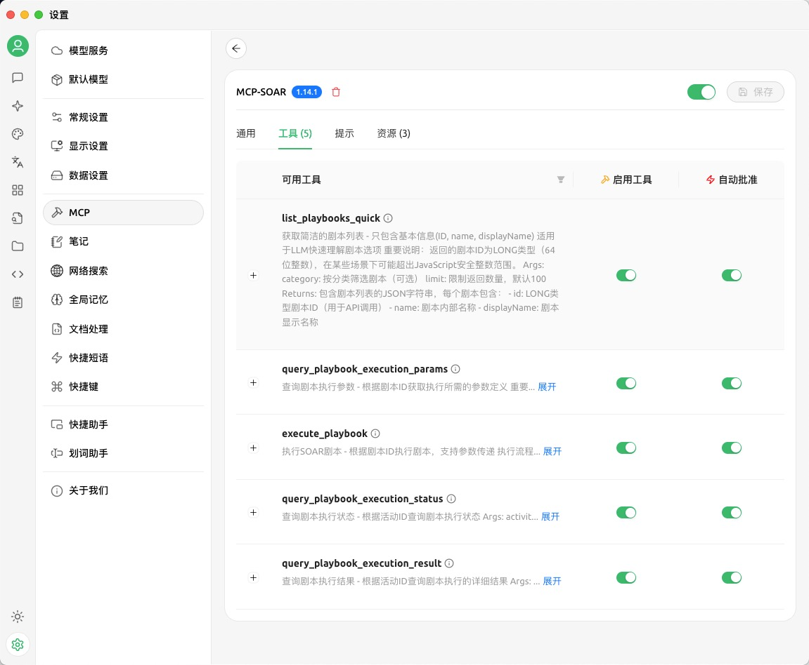
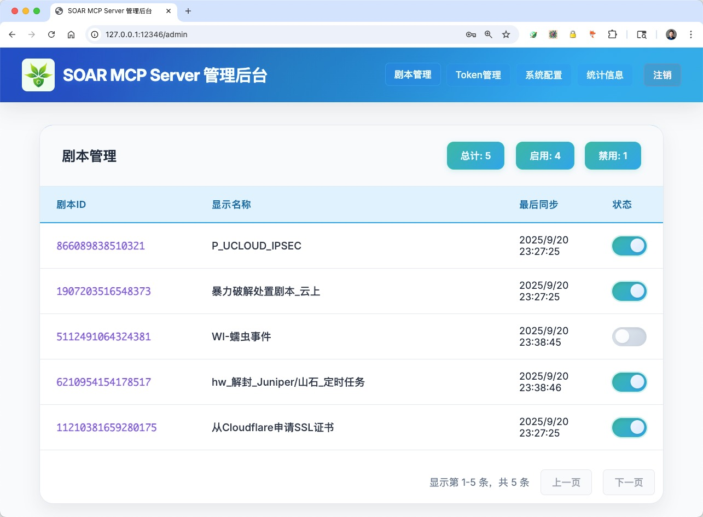
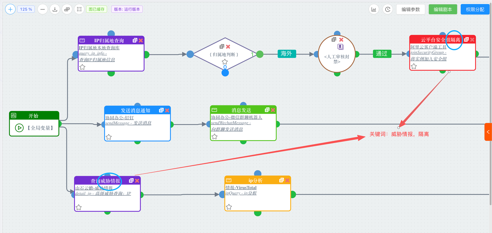
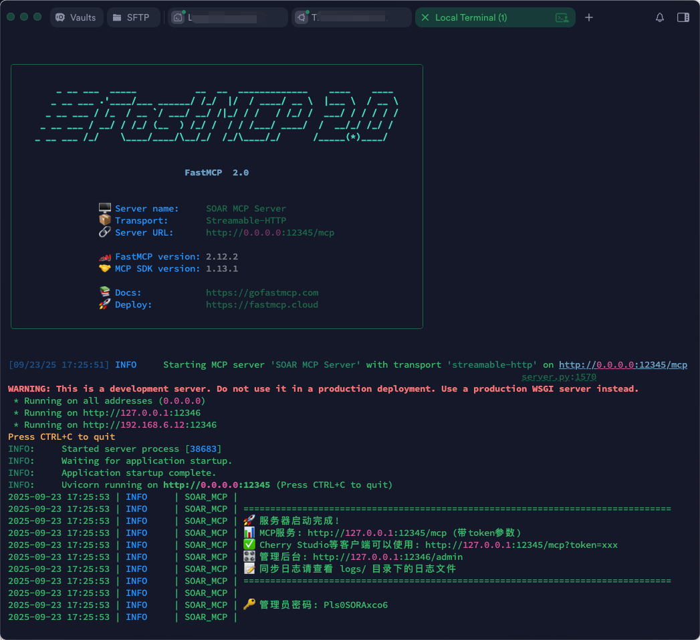
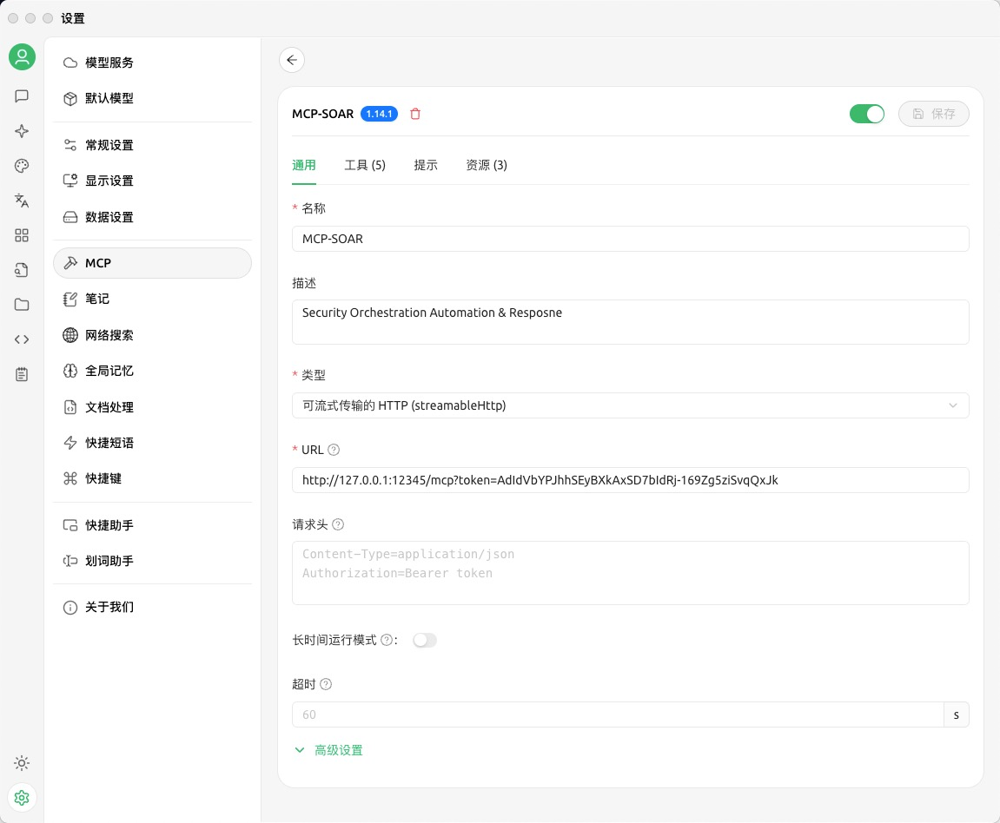
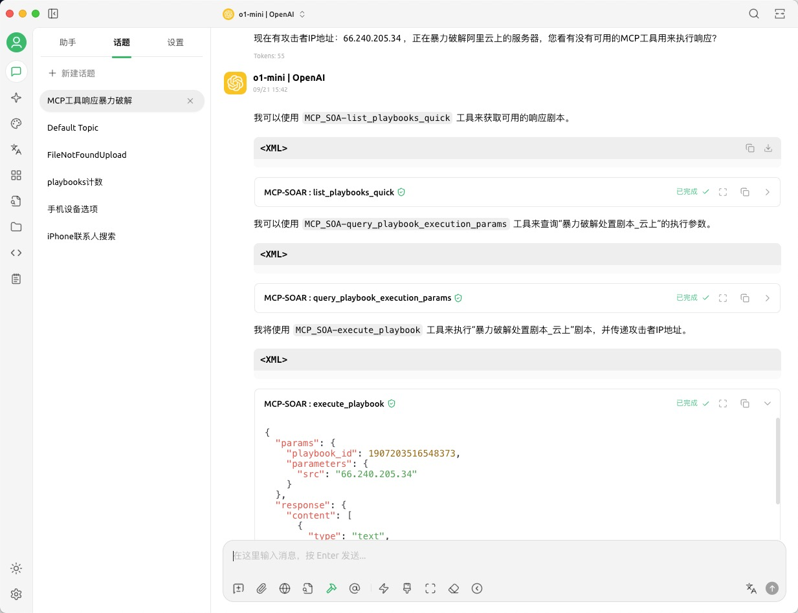

# SOAR MCP Server

<div align="center">


基于 **[OctoMation SOAR 平台](https://github.com/flagify-com/OctoMation)** 的 **Model Context Protocol (MCP)** 服务器，为 Claude Desktop、Cherry Studio、Cursor、Trae 等 AI 客户端提供安全编排、自动化和响应能力。

[](https://opensource.org/licenses/MIT)
[](https://www.python.org/downloads/)
[](https://modelcontextprotocol.io/)

[功能特性](#功能特性) • [快速开始](#快速开始) • [更新日志](CHANGELOG.md) • [从旧版本升级](#-从旧版本升级) • [管理工具](#管理工具) • [配置说明](#配置说明) • [安全特性](#-安全特性) • [故障排除](#故障排除)

</div>

## 概述

SOAR MCP Server 是一个创新的安全编排平台集成解决方案，**专为 [OctoMation SOAR 平台](https://github.com/flagify-com/OctoMation) 设计**。通过 Model Context Protocol 将 SOAR (Security Orchestration, Automation and Response) 能力直接集成到各种 AI 客户端中，包括 Claude Desktop、Cherry Studio、Cursor、Trae 等。它提供了完整的安全事件管理、剧本执行、威胁情报查询等功能，让 AI 助手具备专业的网络安全响应能力。

## 🆕 v1.6.0 更新摘要

- **关键结果提取**：新增剧本动作节点名称关键词，支持在剧本执行结果中提取关键节点与资产结果
- **结果语义拆分**：新增 `query_playbook_execution_overview_by_activity_id` 与 `query_playbook_execution_key_results_by_activity_id`
- **升级治理**：新增 `migrate_db.py` 手动迁移脚本，README 补齐升级风险与升级步骤
- **版本可见性**：管理后台头部、统计页、底部均展示当前版本，便于用户核对升级

完整变更请查看 `CHANGELOG.md`。

## 🏗️ 系统架构



*SOAR MCP Server 采用双服务器架构设计，包含 MCP 服务器、Web 管理服务器、业务逻辑层、数据存储层和外部系统集成层，提供完整的安全编排自动化解决方案。*

### 技术架构要点

| 模块 | 技术选型 | 说明 |
|------|---------|------|
| MCP 服务 | FastMCP 2.x + Streamable-HTTP | 异步工具函数，共享 httpx 连接池 |
| 管理后台 | Flask | JWT 认证，RESTful API |
| 数据库 | SQLAlchemy ORM + SQLite | 上下文管理器 session，BigInteger ID |
| MCP 认证 | Bearer Token + URL参数 | 双模式认证，Bearer 推荐 |
| 密码安全 | bcrypt | 带盐哈希，防彩虹表攻击 |
| 请求上下文 | contextvars | 原生支持异步协程隔离 |
| 日志 | RotatingFileHandler | 自动轮转，单文件 10MB，保留 5 份 |

### 🎯 OctoMation SOAR 平台

本项目专为 **[OctoMation SOAR 平台](https://github.com/flagify-com/OctoMation)** 设计，OctoMation 是一个功能强大的安全编排、自动化和响应平台，提供：

- 🛡️ **完整的安全工具链**：支持主流安全产品和平台
- 📚 **丰富的安全剧本**：预置大量实用的安全响应剧本
- 🔄 **灵活的工作流**：可视化剧本编排和自动化执行
- 🌐 **开放架构**：支持自定义集成和扩展

### 核心优势

- 🔒 **安全编排**：无缝对接 OctoMation SOAR 平台
- 🤖 **AI 驱动**：通过多种 AI 客户端实现智能安全响应
- ⚡ **异步架构**：MCP 工具函数全异步，httpx 连接池复用
- 🌐 **Web 管理**：直观的可视化管理界面
- 🔧 **灵活配置**：支持多种部署和配置方式
- 🛡️ **安全加固**：bcrypt 密码哈希、JWT 密钥持久化、日志脱敏

## 功能特性

### 🛠️ MCP 工具集


*SOAR MCP 服务器提供的完整工具集*

#### 剧本查询与执行
- `list_playbooks_quick` - 获取简洁的剧本列表（ID、name、displayName），适用于 AI 快速理解剧本选项
- `query_playbook_execution_params` - 根据剧本ID查询执行所需的参数定义
- `execute_playbook` - 执行指定的 SOAR 剧本，支持参数传递（异步）
- `query_playbook_execution_status_by_activity_id` - 根据活动ID查询剧本执行状态（异步）
- `query_playbook_execution_overview_by_activity_id` - 根据活动ID查询剧本执行概览结果（异步）
- `query_playbook_execution_key_results_by_activity_id` - 根据活动ID查询剧本执行关键结果（异步）

#### 重要说明
- **剧本ID格式**：支持 LONG 类型（64位整数），可以使用整数或字符串格式
- **执行流程**：查询参数 → 执行剧本 → 检查状态 → 查概览结果 / 查关键结果
- **兼容性**：剧本ID 可能超出 JavaScript 安全整数范围，建议使用字符串格式
- **关键结果提取**：`query_playbook_execution_key_results_by_activity_id` 不需要额外传关键词，关键词来自管理后台对剧本的配置

### 📊 MCP 资源

- `soar://playbooks` - SOAR 剧本列表
- `soar://applications` - SOAR 应用列表
- `soar://executions` - 执行活动记录

### 🌐 Web 管理界面


*SOAR MCP 服务器 Web 管理界面 - 剧本管理页面*

- **剧本管理**：可视化剧本列表、状态管理、执行监控
- **Token 管理**：API 访问凭证的创建、管理和监控
- **系统配置**：SOAR 连接设置、同步配置、SSL 验证开关
- **密码管理**：独立的管理员密码修改入口和安全策略说明
- **统计信息**：系统状态、执行统计、同步时间

#### 关键结果提取配置

在管理后台的剧本详情中，可以为每个剧本配置“剧本动作节点名称关键词”：

- 支持按 `Enter`、英文逗号 `,`、中文逗号 `，` 录入多个关键词
- 多个关键词之间是“或”关系
- 系统会在剧本执行结果的 `nodeResultModels.displayName` 中按包含关系匹配这些节点名称关键词
- 命中后，会返回这些节点及其对应的 `assetResultModels`

> 提示：为了让关键结果提取更稳定，建议在 SOAR 的剧本节点显示名称中直接加入这些关键词，例如 `[威胁情报] 查询 IP`、`[隔离] 云主机安全组处置`。


*管理后台中的“剧本动作节点名称关键词”展示与配置入口*

## 🚀 快速开始

本指南将带你从零开始部署和配置 SOAR MCP Server。

### 📋 环境要求

**系统要求**：
- Python 3.9+
- 4GB+ 内存
- 网络连接（用于 SOAR API 访问）

**支持平台**：
- Linux (Ubuntu 18.04+, CentOS 7+)
- macOS (10.14+)
- Windows 10/11

### 🛠️ 第一步：项目部署

#### 1. 获取项目代码

```bash
# 克隆项目
git clone https://github.com/flagify-com/soar-mcp.git
cd soar-mcp

# 或直接下载发布版本
wget https://github.com/flagify-com/soar-mcp/releases/latest/download/soar-mcp.zip
unzip soar-mcp.zip && cd soar-mcp
```

#### 2. 环境配置

```bash
# 创建 Python 虚拟环境
python3 -m venv venv

# 激活虚拟环境
# Linux/macOS:
source venv/bin/activate
# Windows:
# venv\Scripts\activate

# 升级 pip 并安装依赖
pip install --upgrade pip
pip install -r requirements.txt
```

#### 2.1 容器方式（可选）

```bash
# 本地构建镜像
docker build -t soar-mcp:local .

# 运行（建议挂载日志和数据库目录）
docker run -d --name soar-mcp \
  -p 12345:12345 -p 12346:12346 \
  -e BIND_HOST=0.0.0.0 \
  -v $(pwd)/logs:/app/logs \
  -v $(pwd)/data:/app/data \
  soar-mcp:local
```

> 提示：镜像内默认 `MCP_PORT=12345`、`ADMIN_PORT=12346`、`BIND_HOST=0.0.0.0`，可通过环境变量覆盖。

#### 3. 首次启动

```bash
# 直接启动服务器
python3 soar_mcp_server.py
```

🎉 **恭喜！服务器已启动**

首次运行时，系统会自动：
- ✅ 创建数据库和初始配置
- ✅ 生成管理员密码（**仅在控制台显示一次，不写入日志文件**）
- ✅ 生成并持久化 JWT 签名密钥
- ✅ 启动 MCP 服务器和 Web 管理界面
- ⚠️ 跳过 SOAR 剧本同步（需要后续配置）

**重要输出信息**：
```
============================================================
  🔑 管理员初始密码: a$bC9*xYz2M&
  ⚠️  请妥善保管，此密码不会再次显示！
============================================================

📊 MCP服务: http://127.0.0.1:12345/mcp
   认证方式1: Authorization: Bearer <token> (推荐)
   认证方式2: http://127.0.0.1:12345/mcp?token=<token> (兼容)
🎛️  管理后台: http://127.0.0.1:12346/admin
```

> ⚠️ **安全提示**：管理员密码仅在首次启动时通过控制台显示，不会记录到日志文件。请务必立即保存。如果遗失，可使用 `./reset_admin_password.sh` 重置。

> 🔐 **上线建议**：首次登录后台后，请立即前往导航栏的「密码管理」页面修改管理员密码，再继续进行 SOAR 平台初始化配置。


*SOAR MCP 服务器启动后的控制台输出界面*

### 🐳 自动构建与发布（GitHub Actions）

仓库内置 `.github/workflows/docker-publish.yml`：

- `pull_request`：只做镜像构建验证（不推送）
- `push main`：构建并推送到 GHCR
- `push tag(v*)`：构建版本镜像并推送到 GHCR
- `workflow_dispatch`：手动触发

默认镜像地址：

```text
ghcr.io/<owner>/<repo>
```

例如 `ghcr.io/flagify-com/soar-mcp`。

### ⚙️ 第二步：SOAR 平台配置

#### 1. 访问管理后台

1. 打开浏览器，访问 `http://127.0.0.1:12346/admin`
2. 使用控制台显示的管理员密码登录
3. 未配置 SOAR 时，系统会自动进入「系统配置」并显示首次配置引导

#### 2. 配置 SOAR 连接

在系统配置页面填入以下信息：

| 配置项 | 说明 | 示例值 |
|--------|------|--------|
| **SOAR服务器API地址** | SOAR 平台的 API 基础地址 | `https://your-soar.com` |
| **API Token** | SOAR 平台的 JWT 认证令牌 | `eyJhbGciOiJIUzI1NiIs...` |
| **超时时间** | API 请求超时（秒） | `30` |
| **SSL 证书验证** | HTTPS 证书校验开关 | `开启` |
| **同步周期** | 数据同步间隔 | `12小时` |
| **剧本抓取标签** | 过滤同步的剧本标签 | `MCP` |

#### 3. 测试和保存

1. 点击「测试连接」按钮验证配置
2. 看到 ✅ "API连接测试成功！" 后，点击「保存配置」
3. 系统将自动开始同步 SOAR 剧本数据

> 说明：SOAR 连接参数现在以数据库配置为准，运行中的服务不会再从 `.env` 读取 `API_URL`、`API_TOKEN`、`SSL_VERIFY` 作为运行时配置。

### 🤖 第三步：MCP 客户端配置

支持多种基于大模型的 MCP 客户端，包括但不限于：**Cherry Studio**、**Claude Desktop**、**Cursor**、**Trae** 等。

#### Cherry Studio（推荐）


*在 Cherry Studio 中配置 SOAR MCP 服务器*

1. **打开 Cherry Studio**
2. **进入设置** → **MCP 服务器**
3. **编辑配置文件**，添加以下内容：

   **方式一：URL 参数（兼容性好）**
   ```json
   {
     "mcpServers": {
       "soar-mcp": {
         "type": "http",
         "name": "soar-mcp",
         "description": "SOAR 安全编排平台集成",
         "url": "http://127.0.0.1:12345/mcp?token=xxxx"
       }
     }
   }
   ```

   **方式二：Bearer Token（推荐，更安全）**
   ```json
   {
     "mcpServers": {
       "soar-mcp": {
         "type": "http",
         "name": "soar-mcp",
         "description": "SOAR 安全编排平台集成",
         "url": "http://127.0.0.1:12345/mcp",
         "headers": {
           "Authorization": "Bearer xxxx"
         }
       }
     }
   }
   ```

4. **保存并重启 Cherry Studio**


*在 Cherry Studio 中成功使用 SOAR MCP 服务器功能*

⚠️ **重要**：将 `xxxx` 替换为从管理后台获取的实际API Token。Bearer Token 方式更安全，Token 不会暴露在 URL 和日志中。

#### Claude Desktop

编辑 Claude Desktop 的 MCP 配置文件：

**位置**：
- macOS: `~/Library/Application Support/Claude/claude_desktop_config.json`
- Windows: `%APPDATA%\Claude\claude_desktop_config.json`

**配置内容（URL 参数方式）**：
```json
{
  "mcpServers": {
    "soar-mcp": {
      "type": "http",
      "name": "soar-mcp",
      "description": "SOAR 安全编排平台集成",
      "url": "http://127.0.0.1:12345/mcp?token=xxxx"
    }
  }
}
```

**配置内容（Bearer Token 方式，推荐）**：
```json
{
  "mcpServers": {
    "soar-mcp": {
      "type": "http",
      "name": "soar-mcp",
      "description": "SOAR 安全编排平台集成",
      "url": "http://127.0.0.1:12345/mcp",
      "headers": {
        "Authorization": "Bearer xxxx"
      }
    }
  }
}
```

⚠️ **重要**：
- 将 `xxxx` 替换为从管理后台获取的实际API Token
- Bearer Token 方式更安全，推荐优先使用
- Claude Desktop 需要重启才能加载新配置

#### 其他 MCP 客户端

**通用配置参数**：
- **协议**: `HTTP` (Streamable-HTTP)
- **服务器 URL**: `http://127.0.0.1:12345/mcp`
- **认证方式**（二选一）:
  - **推荐**: HTTP Header `Authorization: Bearer <token>`
  - **兼容**: URL 参数 `http://127.0.0.1:12345/mcp?token=xxxx`

### 🧪 第四步：功能验证

#### 验证 MCP 连接

在 MCP 客户端中输入：
```
请列出所有可用的 SOAR 剧本
```

正常情况下会返回：
```
📋 当前可用的 SOAR 剧本：

1. 🔍 IP信誉检查剧本 (ID: "1907203516548373")
   - 内部名称: ip_reputation_check
   - 显示名称: IP信誉检查剧本
   - 状态: 启用中
```

#### 完整执行流程示例

1. **查询剧本参数**：
```
请查询剧本 1907203516548373 需要哪些执行参数
```

2. **执行剧本**：
```
请执行剧本 1907203516548373，检查IP地址 192.168.1.100
```

3. **查看执行状态**：
```
查看活动ID为 xxx 的剧本执行状态
```

4. **获取执行结果**：
```
获取活动ID为 xxx 的剧本执行概览结果
```

5. **获取关键结果**：
```
获取活动ID为 xxx 的剧本执行关键结果
```

#### 本地单元测试

建议在改动剧本结果提取相关逻辑后，执行下面的本地单元测试：

```bash
python3 -m unittest discover -s tests -p 'test_playbook_result_views.py'
```

## 📦 从旧版本升级

当前版本相对旧版本有一项**数据库结构新增**和一项**MCP 工具语义调整**。如果你是新部署用户，可以直接忽略本节；如果你是带历史数据升级，请按下面步骤执行。

### 这次升级改了什么

#### 1. 数据库变更

`playbooks` 表新增了一个字段：

```sql
result_focus_keywords TEXT DEFAULT '[]'
```

这个字段用于保存每个剧本配置的“剧本动作节点名称关键词”，供 `query_playbook_execution_key_results_by_activity_id` 自动筛选关键节点结果使用。

#### 2. MCP 工具语义调整

剧本执行结果查询从单一结果查询拆成了两个语义化工具：

- `query_playbook_execution_overview_by_activity_id`
- `query_playbook_execution_key_results_by_activity_id`

如果你的 MCP 客户端提示词、脚本或自动化流程里显式写死了旧工具名 `query_playbook_execution_result_by_activity_id`，升级后需要同步改成新的工具名。

### 升级风险一览

| 项目 | 是否有风险 | 说明 |
|------|------------|------|
| SOAR 配置 | 低 | 数据库存储，原有配置会保留 |
| 剧本/应用数据 | 低 | 原有同步数据会保留 |
| 用户 Token | 低 | 原有 Token 会保留 |
| 审计日志 | 低 | 原有日志会保留 |
| `playbooks.result_focus_keywords` | 低 | 启动时自动迁移，也可手动执行迁移脚本 |
| MCP 结果查询工具名 | 中 | 显式依赖旧工具名的客户端需要更新 |
| 管理员密码（仅 v1.0.x -> v1.1.0+） | 高 | 老版本 SHA-256 密码哈希不兼容，必须重置 |

### 数据库迁移说明

系统启动时会自动执行数据库初始化和迁移，核心逻辑在 `DatabaseManager.init_db()` 中，包含对旧版 `playbooks` 表补列的处理。

为了方便在生产环境中先迁移再启动，仓库额外提供了一个手动迁移脚本：

```bash
python3 migrate_db.py --db-path soar_mcp.db
```

脚本特性：

- 可重复执行，幂等
- 不会清空现有数据
- 如果字段已存在，会直接跳过
- 迁移完成后会打印当前 `playbooks` 表字段列表

### 推荐升级步骤

```bash
# 1. 停止旧服务

# 2. 备份旧数据库
cp soar_mcp.db soar_mcp.db.bak

# 3. 更新代码
git pull origin main

# 4. 安装或更新依赖
source venv/bin/activate
pip install -r requirements.txt

# 5. 先执行数据库迁移（推荐）
python3 migrate_db.py --db-path soar_mcp.db

# 6. 如果你是从 v1.0.x 升级到 v1.1.0+，再重置管理员密码
./reset_admin_password.sh --random

# 7. 启动服务
python3 soar_mcp_server.py
```

### 升级后检查项

升级完成后，建议至少确认下面几项：

1. 管理后台可以正常打开，剧本详情中能看到“剧本动作节点名称关键词”
2. 旧的 SOAR 配置、Token、剧本列表仍然存在
3. 调用 `query_playbook_execution_overview_by_activity_id` 能返回概览结果
4. 给某个剧本配置关键词后，调用 `query_playbook_execution_key_results_by_activity_id` 能返回关键结果
5. 如果你有自定义提示词或自动化脚本，确认它们已经改用新的结果查询工具名

> 提示：对于大多数已有用户，数据库数据本身没有破坏性变化；真正需要额外注意的是旧密码兼容性和旧 MCP 工具名切换。

## 🔧 管理工具

### 管理员密码重置

如果忘记了管理员密码，可以使用密码管理脚本：

```bash
# 交互模式（推荐）- 可选随机生成或指定密码
./reset_admin_password.sh

# 直接生成随机密码
./reset_admin_password.sh --random

# 设置指定密码
./reset_admin_password.sh --set 'YourNewPassword'
```

**脚本特性**：
- 🔒 使用 **bcrypt** 安全哈希（与服务器一致）
- 🎨 交互式彩色界面，支持密码确认
- ⚡ 密码立即生效，无需重启服务
- ✅ 自动检测虚拟环境和依赖

**使用示例**：
```bash
$ ./reset_admin_password.sh

==========================================
    SOAR 管理员密码工具 v2.0 (bcrypt)
==========================================

请选择操作：
  1) 生成随机密码
  2) 设置指定密码
  q) 取消

请输入选项 [1/2/q]: 1

[SUCCESS] 🎉 管理员密码已更新！

======================================
  管理员密码: xK9#mBnP2vLq
======================================

[INFO] 密码立即生效，无需重启服务
```

### 高级配置

#### 环境变量配置

SOAR 平台连接信息现在统一在管理后台初始化和维护，`.env` 只保留服务器自身运行参数：

```bash
# MCP 服务器配置
MCP_PORT=12345
ADMIN_PORT=12346
BIND_HOST=127.0.0.1  # 默认仅本地访问，设为 0.0.0.0 可对外暴露

# 日志配置
DEBUG=0
LOG_LEVEL=INFO
```

#### 系统服务配置

创建 systemd 服务（Linux）：

```bash
sudo nano /etc/systemd/system/mcp-soar.service
```

```ini
[Unit]
Description=MCP SOAR Server
After=network.target

[Service]
Type=simple
User=your-username
WorkingDirectory=/path/to/soar-mcp
Environment=PATH=/path/to/soar-mcp/venv/bin
ExecStart=/path/to/soar-mcp/venv/bin/python soar_mcp_server.py
Restart=always
RestartSec=3

[Install]
WantedBy=multi-user.target
```

```bash
# 启用并启动服务
sudo systemctl daemon-reload
sudo systemctl enable mcp-soar
sudo systemctl start mcp-soar
```

## 🔒 安全特性

v1.1.0+ 版本包含以下安全加固措施：

| 特性 | 说明 |
|------|------|
| **双模式 Token 认证** | 支持 HTTP Bearer Token（推荐）和 URL 参数两种认证方式，Bearer Token 不暴露在 URL 和日志中 |
| **bcrypt 密码哈希** | 替代 SHA-256，防止彩虹表攻击 |
| **JWT 密钥持久化** | 密钥存储在数据库中，服务重启后 Token 不会失效 |
| **密码日志脱敏** | 管理员密码仅输出到控制台，不写入日志文件 |
| **SSL 验证默认开启** | 默认验证 HTTPS 证书，可通过配置关闭（适配自签名证书） |
| **服务默认本地绑定** | 默认绑定 `127.0.0.1`，防止意外暴露到网络 |
| **API 错误脱敏** | 管理 API 不返回内部异常堆栈信息 |
| **审计日志** | 所有 MCP 工具调用均记录审计日志 |
| **日志轮转** | 自动轮转日志文件（10MB/文件，保留 5 份） |
| **有界执行记录** | 执行记录上限 1000 条，自动淘汰最旧条目 |

## 测试

### 运行测试套件

```bash
# 运行 MCP 客户端测试
cd tests
python mcp_soar_client.py

# 运行 Bearer Token 认证单元测试（无需启动服务器）
python tests/test_bearer_auth.py --unit-only

# 运行 Bearer Token 认证集成测试（需要服务器运行 + 有效Token）
python tests/test_bearer_auth.py --token <your_token>

# 运行自动化测试
./tests/test_automation.sh

# 测试剧本执行功能
python tests/test_new_playbook_tools.py --playbook-id 1907203516548373
```

## 配置说明

### 环境变量

| 变量名 | 说明 | 默认值 | 必需 |
|--------|------|--------|------|
| `MCP_PORT` | MCP 服务器端口 | `12345` | ❌ |
| `ADMIN_PORT` | Web 管理界面端口 | `12346` | ❌ |
| `BIND_HOST` | 服务绑定地址 | `127.0.0.1` | ❌ |
| `SKIP_SYNC` | 跳过启动同步 | `false` | ❌ |
| `DEBUG` | 调试模式 | `0` | ❌ |

> 注：SOAR 连接配置不再使用环境变量，统一通过 Web 管理后台管理并持久化到数据库中。

### 数据库配置

默认使用 SQLite，数据库文件在首次启动时自动创建：

```bash
# 默认 SQLite 路径
soar_mcp.db
```

## 故障排除

### 常见问题

#### 1. MCP 连接失败

**症状**：AI 客户端无法连接到 MCP 服务器

**解决方案**：
```bash
# 检查端口占用
lsof -i :12345

# 查看日志（日志文件按日期命名，自动轮转）
ls -la logs/
tail -f logs/soar_mcp_$(date +%Y%m%d).log
```

#### 2. API 认证失败

**症状**：403 Forbidden 或 401 Unauthorized

**解决方案**：
- 检查管理后台中的 SOAR API 配置是否正确
- 确认 API Token 未过期
- 验证 API 地址是否可达

#### 3. 管理员密码丢失

**解决方案**：
```bash
# 使用密码重置脚本
./reset_admin_password.sh --random
```

#### 4. SSL 证书验证失败

**症状**：内网自签名证书导致 SOAR API 连接失败

**解决方案**：
在管理后台「系统配置」中关闭“SSL 证书验证”，保存后重新测试连接。

#### 5. 服务需要对外暴露

**默认情况下服务仅监听 127.0.0.1**，如需局域网访问：

```bash
# 在 .env 中设置
BIND_HOST=0.0.0.0
```

## 许可证

本项目采用 MIT 许可证。详情请参阅 [LICENSE](LICENSE) 文件。

## 支持与反馈

- 🐛 **问题反馈**：[GitHub Issues](https://github.com/flagify-com/soar-mcp/issues)
- 💬 **讨论交流**：[GitHub Discussions](https://github.com/flagify-com/soar-mcp/discussions)
- 📧 **邮件联系**：support@wuzhi-ai.com

## 致谢

本项目的MCP服务器实现基于 [FastMCP](https://github.com/jlowin/fastmcp) 框架构建。FastMCP 提供了优雅的 Python MCP 服务器开发体验，让我们能够快速构建高质量的 MCP 服务器。感谢 FastMCP 团队的优秀工作！

## 相关链接

- [Model Context Protocol](https://modelcontextprotocol.io/) - MCP 官方文档
- [FastMCP](https://github.com/jlowin/fastmcp) - Python MCP 服务器框架
- [OctoMation Wiki](https://github.com/flagify-com/OctoMation/wiki) - SOAR 平台文档
- [雾帜智能](https://flagify.com) - 公司官网

---

<div align="center">

**雾帜智能@2025** | [最牛的SOAR](https://flagify.com) | [OctoMation](https://github.com/flagify-com/OctoMation/wiki)

*为 AI 赋能网络安全* 🔒

</div>
