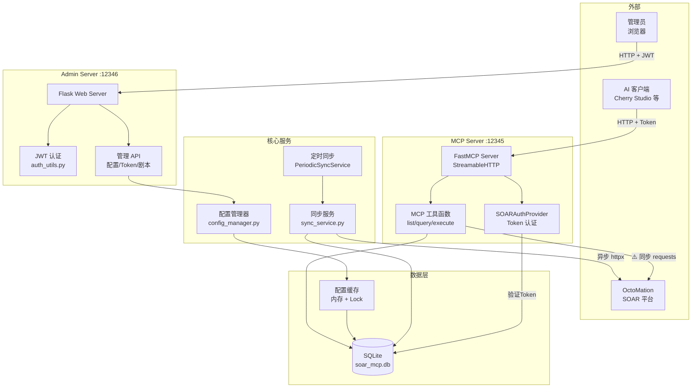

# SOAR MCP Server 代码评审报告

> **评审时间**: 2026-02-09  
> **评审版本**: v1.0.4 (commit d24b21e)  
> **评审范围**: 全部核心源码 (`soar_mcp_server.py`, `models.py`, `auth_utils.py`, `sync_service.py`, `config_manager.py`, `auth_provider.py`, `logger_config.py`)

---

## 一、评审摘要

| 类别 | 严重 | 重要 | 一般 | 合计 |
|------|:----:|:----:|:----:|:----:|
| 安全问题 | 4 | 4 | 2 | 10 |
| 架构设计 | 2 | 4 | 1 | 7 |
| 代码质量 | 1 | 5 | 5 | 11 |
| 健壮性 | 0 | 3 | 2 | 5 |
| **合计** | **7** | **16** | **10** | **33** |

---

## 二、安全问题

### S-01 [严重] 密码哈希使用 SHA-256 且无盐值

**文件**: `auth_utils.py:32-34`

```python
def hash_password(self, password: str) -> str:
    return hashlib.sha256(password.encode('utf-8')).hexdigest()
```

**问题**: 直接使用 SHA-256 对密码进行哈希，没有添加随机盐值（salt）。SHA-256 是快速哈希算法，不适合密码存储，攻击者可以使用彩虹表或 GPU 暴力破解轻松还原密码。

**建议**: 使用专门的密码哈希库如 `bcrypt`、`argon2-cffi` 或 Python 标准库的 `hashlib.scrypt`。示例：

```python
import bcrypt

def hash_password(self, password: str) -> str:
    return bcrypt.hashpw(password.encode('utf-8'), bcrypt.gensalt()).decode('utf-8')

def verify_password(self, password: str) -> bool:
    stored_hash = db_manager.get_admin_password_hash()
    return bcrypt.checkpw(password.encode('utf-8'), stored_hash.encode('utf-8'))
```

---

### S-02 [严重] JWT Secret Key 每次启动随机生成

**文件**: `auth_utils.py:23-24`

```python
def __init__(self, jwt_secret_key: str = None):
    self.jwt_secret_key = jwt_secret_key or secrets.token_urlsafe(32)
```

**文件**: `soar_mcp_server.py:1419`（调用侧）

```python
auth_manager = create_auth_manager()  # 未传入 jwt_secret_key
```

**问题**: `create_auth_manager()` 未传入密钥，每次服务器重启时 JWT Secret 都会随机重新生成。这意味着：
- 服务器重启后，所有已发出的管理员 JWT 立即失效
- 无法在多实例部署中共享会话

**建议**: 将 JWT Secret Key 持久化到数据库或环境变量中，首次生成后复用。

---

### S-03 [严重] 管理员明文密码写入日志文件

**文件**: `auth_utils.py:49`

```python
logger.info(f"管理员密码已生成: {new_password}")
```

**文件**: `soar_mcp_server.py:1458`

```python
logger.info("🔑 管理员密码: " + admin_password)
```

**问题**: 管理员明文密码被写入日志文件（`logs/soar_mcp_YYYYMMDD.log`）。任何有权限访问日志文件的人都可以获取管理员密码。

**建议**: 仅在控制台（stdout）输出一次密码供初始配置，不写入日志文件。或者使用不同级别的 handler，敏感信息仅输出到 console handler。

---

### S-04 [严重] SSL 验证被全局禁用

**文件**: `sync_service.py:27`

```python
ssl._create_default_https_context = ssl._create_unverified_context
```

**文件**: `soar_mcp_server.py:20`

```python
urllib3.disable_warnings(urllib3.exceptions.InsecureRequestWarning)
```

**问题**: 全局修改了 Python 的 SSL 默认上下文，这影响整个进程中的所有 HTTPS 连接（包括第三方库），不仅仅是对 SOAR API 的请求。同时禁用了 SSL 警告，使问题更难被发现。

**建议**: 仅在特定的 HTTP 客户端实例上禁用 SSL 验证，而不是全局修改：

```python
# httpx 客户端 - 仅影响此实例
client = httpx.AsyncClient(verify=False)

# requests - 仅影响此次请求
requests.post(url, verify=False)
```

移除 `ssl._create_default_https_context` 的全局覆盖。

---

### S-05 [重要] JWT Payload 包含密码哈希片段

**文件**: `auth_utils.py:85-88`

```python
payload = {
    'user_type': 'admin',
    'password_hash': self.hash_password(admin_password)[-8:],
    'login_time': datetime.utcnow().isoformat()
}
```

**问题**: JWT payload 中存储了密码哈希的最后 8 个字符。JWT payload 是 Base64 编码（非加密），任何人解码 JWT 就能看到这些信息。虽然只是片段，但不必要地暴露了密码派生信息。

**建议**: 移除 `password_hash` 字段，改用 session ID 或随机标识符来追踪登录会话。

---

### S-06 [重要] Token 通过 URL 参数传输

**文件**: `auth_provider.py:46`

```python
token_value = request.query_params.get('token')
```

**问题**: MCP Token 通过 URL 查询参数 `?token=xxx` 传递。URL 参数会出现在：
- Web 服务器访问日志
- 浏览器历史记录
- HTTP Referer 头
- 中间代理/CDN 日志

**建议**: 优先使用 `Authorization: Bearer <token>` 请求头传递 Token，同时保留 URL 参数作为兼容性方案。

---

### S-07 [重要] 管理后台和 MCP 均绑定 0.0.0.0

**文件**: `soar_mcp_server.py:716`

```python
admin_app.run(host='0.0.0.0', port=port, debug=False, use_reloader=False)
```

**文件**: `soar_mcp_server.py:1472`

```python
mcp.run(transport="streamable-http", host="0.0.0.0", port=port, ...)
```

**问题**: 两个服务器默认监听所有网络接口，直接暴露在网络中。在没有额外网络防护的情况下，管理后台和 MCP 接口可被任何人访问。

**建议**: 默认绑定 `127.0.0.1`，仅在用户通过环境变量明确指定时绑定 `0.0.0.0`。

---

### S-08 [重要] verify_mcp_token 实际不做验证

**文件**: `soar_mcp_server.py:151-157`

```python
def verify_mcp_token(action: str = "unknown", ...) -> bool:
    log_audit_from_context(action, resource, parameters)
    return True  # AuthProvider已经完成认证，这里总是返回True
```

**问题**: 函数名 `verify_mcp_token` 暗示它在进行 Token 验证，但实际上只记录审计日志，始终返回 `True`。所有 MCP 工具函数都依赖此函数的返回值做权限检查分支，如果 AuthProvider 未正确加载或配置，所有请求将无条件通过。

**建议**: 要么将此函数重命名为 `log_mcp_audit`（消除歧义），要么在其中增加实际的认证检查作为纵深防御。移除工具函数中基于返回值的 if 分支（因为永远为 True，属于死代码）。

---

### S-09 [一般] 配置验证/测试时直接修改全局缓存

**文件**: `soar_mcp_server.py:533-538`

```python
config_manager._config_cache.update({
    'soar_api_url': config_data.soar_api_url,
    'soar_api_token': config_data.soar_api_token,
    ...
})
```

**问题**: `validate_system_config` 和 `test_connection` API 在验证/测试时直接修改了 `config_manager._config_cache`。在并发请求场景下，一个管理员的验证操作可能影响另一个正在使用配置的请求，造成数据竞争。

**建议**: 创建配置的临时副本进行验证/测试，不修改全局缓存。

---

### S-10 [一般] 硬编码的内部 API 地址

**文件**: `config_manager.py:69, 98`

```python
soar_api_url=config.get("soar_api_url", "https://hg.wuzhi-ai.com"),
```

**问题**: 将内部的 SOAR 平台地址硬编码为默认值。在开源项目中，这暴露了内部基础设施信息。

**建议**: 将默认值设为空字符串 `""`，强制用户在首次配置时手动填写。

---

## 三、架构设计问题

### A-01 [严重] 异步环境中使用同步阻塞 HTTP 调用

**文件**: `soar_mcp_server.py:918`

```python
response = requests.post(api_url, headers=headers, json=api_request,
                         timeout=timeout, verify=ssl_verify)
```

**问题**: MCP 工具函数（`execute_playbook`, `query_playbook_execution_status_by_activity_id`, `query_playbook_execution_result_by_activity_id`）中使用同步的 `requests` 库调用 SOAR API。FastMCP 是基于异步框架的服务器，同步 HTTP 调用会阻塞事件循环，导致：
- 所有并发请求被串行化
- 服务器响应延迟显著增加
- 在高并发下可能导致请求超时

而 `sync_service.py` 中正确地使用了异步的 `httpx.AsyncClient`。

**建议**: 将 MCP 工具函数中的 `requests` 调用替换为 `httpx.AsyncClient`，保持架构一致性。

---

### A-02 [严重] threading.local 与异步框架不兼容

**文件**: `soar_mcp_server.py:45`

```python
request_context = threading.local()
```

**问题**: 使用 `threading.local()` 存储当前请求的用户信息。在异步框架中，同一线程可能交替处理多个请求（协程切换），`threading.local` 的数据会在不同请求间串扰，导致：
- 审计日志记录了错误的用户信息
- 权限检查可能使用了其他请求的上下文

**建议**: 使用 Python 的 `contextvars.ContextVar` 替代 `threading.local`，它天然支持异步上下文隔离：

```python
from contextvars import ContextVar

request_token: ContextVar[str] = ContextVar('request_token', default=None)
request_token_info: ContextVar[dict] = ContextVar('request_token_info', default=None)
```

---

### A-03 [重要] 全局内存字典无限增长

**文件**: `soar_mcp_server.py:42`

```python
EXECUTIONS = {}
```

**问题**: `EXECUTIONS` 字典用于存储执行记录，每次执行剧本后追加（第942行），但没有任何清理机制。在长时间运行的服务器中，这将导致内存持续增长。

**建议**: 
- 使用 `collections.OrderedDict` 并限制最大条目数
- 或使用带 TTL 的缓存（如 `cachetools.TTLCache`）
- 或将执行记录持久化到数据库中

---

### A-04 [重要] 定时同步线程中频繁创建事件循环

**文件**: `soar_mcp_server.py:1311, 1325`

```python
asyncio.run(self._perform_sync())
```

**文件**: `soar_mcp_server.py:470-471`（配置更新触发的同步）

```python
loop = asyncio.new_event_loop()
asyncio.set_event_loop(loop)
```

**问题**: 定时同步和配置变更触发的同步都在后台线程中调用 `asyncio.run()` 或手动创建新事件循环。每次同步都创建/销毁事件循环，开销大，且不符合最佳实践。

**建议**: 为后台同步线程创建一个持久化的事件循环，或使用专门的异步任务队列。

---

### A-05 [重要] 数据库 Session 管理模式不一致

**文件**: `models.py:279-286`

```python
def get_session(self):
    session = self.SessionLocal()
    try:
        return session
    except Exception:
        session.close()
        raise
```

**问题**: `get_session()` 方法设计存在多个问题：
1. `try` 块中只有 `return session`，不可能抛出异常，所以 `except` 块永远不会执行
2. 所有调用方都需要在 `finally` 中手动关闭 session，代码重复且容易遗漏
3. 没有使用上下文管理器模式

**建议**: 改为上下文管理器模式：

```python
from contextlib import contextmanager

@contextmanager
def get_session(self):
    session = self.SessionLocal()
    try:
        yield session
        session.commit()
    except Exception:
        session.rollback()
        raise
    finally:
        session.close()
```

---

### A-06 [重要] 重复的 JSON 解析代码

**文件**: `models.py:373-384`（get_playbook）和 `models.py:425-434`（get_playbooks）

**问题**: PlaybookParam 的 JSON 解析逻辑在 `get_playbook` 和 `get_playbooks` 中完全重复。如果解析逻辑需要变更，容易遗漏其中一处。

**建议**: 提取为私有方法：

```python
def _parse_playbook_params(self, params_json: str) -> List[PlaybookParam]:
    if not params_json:
        return []
    try:
        return [PlaybookParam(cef_column=p.get("cefColumn", ""), ...) for p in json.loads(params_json)]
    except json.JSONDecodeError:
        return []
```

---

### A-07 [一般] 同步与异步 HTTP 客户端并存

**文件**: `sync_service.py` 使用 `httpx.AsyncClient`；`soar_mcp_server.py` 和 `config_manager.py` 使用同步 `requests`

**问题**: 项目中同时使用了两种 HTTP 客户端库，增加了依赖复杂度和维护成本。

**建议**: 统一使用 `httpx`，它同时支持同步（`httpx.Client`）和异步（`httpx.AsyncClient`）模式。

---

## 四、代码质量问题

### Q-01 [严重] auth_provider.py 引用了不存在的模块名

**文件**: `auth_provider.py:142`

```python
import simple_mcp_server
simple_mcp_server.set_current_user_info(access_token.token, token_info)
```

**问题**: 主模块文件名是 `soar_mcp_server.py`，但此处引用 `simple_mcp_server`，运行时会抛出 `ModuleNotFoundError`。这意味着用户信息的线程本地存储功能实际上从未正常工作。

**建议**: 修正模块名为 `soar_mcp_server`，或者更好的做法是将 `set_current_user_info` 移至独立的上下文管理模块以避免循环导入。

---

### Q-02 [重要] Pydantic model_config 重复定义

**文件**: `models.py:229, 234`

```python
class AppData(BaseModel):
    ...
    model_config = ConfigDict(extra="allow")   # 第229行
    usedTimes: Optional[int] = None
    appCategoryList: List[Dict[str, Any]] = Field(default_factory=list)
    appPackageFile: Optional[str] = None
    model_config = ConfigDict(from_attributes=True)  # 第234行，覆盖了上面的
```

**问题**: `AppData` 类中 `model_config` 被定义了两次，第二次 `ConfigDict(from_attributes=True)` 覆盖了第一次的 `ConfigDict(extra="allow")`，导致 `extra="allow"` 配置丢失。这可能引起 API 返回未知字段时的验证错误。

**建议**: 合并为一个定义：

```python
model_config = ConfigDict(from_attributes=True, extra="allow")
```

---

### Q-03 [重要] 裸 except 捕获所有异常

**文件**: `soar_mcp_server.py:1160`

```python
except:
    return json.dumps({"message": "应用资源暂不可用"}, ...)
```

**文件**: `models.py:1264`

```python
except:
    params = log.parameters
```

**问题**: 裸 `except:` 语句会捕获所有异常，包括 `SystemExit`、`KeyboardInterrupt` 和 `GeneratorExit` 等不应被捕获的异常。这会掩盖真正的问题，使调试困难。

**建议**: 至少使用 `except Exception:`。

---

### Q-04 [重要] 健康检查调用不存在的方法

**文件**: `auth_provider.py:172`

```python
return JSONResponse({
    "status": "healthy",
    "auth_provider": "SOARAuthProvider",
    "timestamp": db_manager.get_current_timestamp()  # 此方法不存在
})
```

**问题**: `DatabaseManager` 类中没有 `get_current_timestamp()` 方法，此健康检查端点在运行时会直接报错。

**建议**: 替换为 `datetime.now().isoformat()`。

---

### Q-05 [重要] PlaybookModel.id 使用 Integer 而非 BigInteger

**文件**: `models.py:24`

```python
class PlaybookModel(Base):
    __tablename__ = "playbooks"
    id = Column(Integer, primary_key=True, autoincrement=True)
```

**问题**: 根据项目文档（CLAUDE.md），剧本 ID 为 LONG 类型（64位整数），例如 `1907203516548373`。`Integer` 在 PostgreSQL/MySQL 中为 32 位有符号整数（最大 2,147,483,647），无法存储此类 ID。虽然 SQLite 内部使用 64 位整数不受影响，但如果未来迁移数据库将出现溢出问题。`AppModel.id` 也存在同样的问题。

**建议**: 将 `PlaybookModel.id` 和 `AppModel.id` 改为 `Column(BigInteger, primary_key=True)`。

---

### Q-06 [重要] execute_playbook 中 ID 类型使用错误

**文件**: `soar_mcp_server.py:896-898`

```python
api_request = {
    "eventId": event_id,
    "executorInstanceId": playbook_id,     # 使用了原始参数（可能是字符串）
    "executorInstanceType": "PLAYBOOK",
    "params": api_params
}
```

**问题**: 代码在第877行已经将 `playbook_id` 解析为整数 `playbook_id_int`，但构造 API 请求时使用了原始的 `playbook_id` 参数（可能是字符串类型）。这可能导致 SOAR API 端接收到错误类型的数据。

**建议**: 改为使用 `playbook_id_int`。

---

### Q-07 [一般] datetime.utcnow() 在 Python 3.12+ 中已弃用

**文件**: `auth_utils.py:63-64`

```python
payload['exp'] = datetime.utcnow() + timedelta(hours=expires_hours)
payload['iat'] = datetime.utcnow()
```

**问题**: `datetime.utcnow()` 在 Python 3.12 中已弃用，因为它返回一个不带时区信息的 datetime 对象，容易产生歧义。

**建议**: 替换为 `datetime.now(timezone.utc)`。

---

### Q-08 [一般] 环境变量名不一致

**文件**: `soar_mcp_server.py:1392`

```python
port = int(os.getenv("SSE_PORT", "12345"))
```

**文件**: `.env.example:8`

```
MCP_PORT=12345
```

**问题**: 代码中使用环境变量 `SSE_PORT`，而 `.env.example` 中定义的是 `MCP_PORT`，两者不一致。用户按 `.env.example` 配置的端口不会生效。

**建议**: 统一使用 `MCP_PORT`，同时保留 `SSE_PORT` 作为后向兼容：

```python
port = int(os.getenv("MCP_PORT", os.getenv("SSE_PORT", "12345")))
```

---

### Q-09 [一般] 未使用的导入

**文件**: `soar_mcp_server.py:14`

```python
from datetime import datetime, timedelta  # timedelta 未被使用
```

**文件**: `soar_mcp_server.py:29`

```python
from auth_provider import soar_auth_provider  # soar_auth_provider 未被使用
```

**问题**: 多个导入的符号在代码中未被使用，增加了不必要的依赖关联。

**建议**: 移除未使用的导入。

---

### Q-10 [一般] 函数内重复导入

**文件**: `soar_mcp_server.py` 中多处函数内导入

```python
# 出现在多个函数中
from config_manager import config_manager
```

**问题**: `config_manager` 在文件中多个函数内被重复导入（第903, 991, 1089, 1214, 1277行等），而非在文件顶部统一导入。这降低了代码可读性，虽然 Python 的模块缓存机制使其性能影响可忽略。

**建议**: 在文件顶部统一导入。

---

### Q-11 [一般] 大量注释掉的代码

**文件**: `soar_mcp_server.py:1244-1258`、`soar_mcp_server.py:1360-1371`

**问题**: 应用同步相关的代码被大段注释，且标注了 `TODO` 但未给出明确时间线。注释代码增加了维护负担。

**建议**: 如果应用同步功能确实暂停，使用功能开关（feature flag）或移入独立分支管理，而非注释代码。

---

## 五、健壮性问题

### R-01 [重要] 日志文件不轮转

**文件**: `logger_config.py:47`

```python
file_handler = logging.FileHandler(log_file, encoding='utf-8')
```

**问题**: 使用 `FileHandler` 而非 `RotatingFileHandler` 或 `TimedRotatingFileHandler`。虽然按日期命名日志文件，但单日内日志量大时文件会无限增长，没有自动清理旧日志的机制。

**建议**: 使用 `RotatingFileHandler` 限制单文件大小，并添加定期清理旧日志文件的逻辑。

---

### R-02 [重要] API 客户端连接未复用

**文件**: `soar_mcp_server.py:918`（execute_playbook 中）

```python
response = requests.post(api_url, ...)
```

**问题**: MCP 工具函数每次调用时都使用 `requests.post()` 创建新的 HTTP 连接。在频繁调用场景下，连接建立开销显著（尤其是 HTTPS 需要 TLS 握手）。

**建议**: 使用 `requests.Session` 或 `httpx.Client` 复用连接池。

---

### R-03 [重要] 同步服务每次创建新的 API 客户端实例

**文件**: `sync_service.py:205`

```python
class PlaybookSyncService:
    def __init__(self, db_manager, max_concurrent=20):
        self.api_client = SOARAPIClient()
```

**问题**: 每次创建 `PlaybookSyncService` 或 `AppsSyncService` 实例时，都会创建新的 `SOARAPIClient`（含 `httpx.AsyncClient`）。在定时同步和配置变更触发的同步中，频繁创建/销毁客户端。同时 `SOARAPIClient.__init__` 中操纵环境变量（第51-52行）不是线程安全的。

**建议**: 使用共享的 API 客户端实例，或至少使用上下文管理器确保正确释放。

---

### R-04 [一般] 缺少 CORS 配置

**文件**: `soar_mcp_server.py`（Flask admin_app）

**问题**: Flask 管理后台应用没有配置 CORS。如果前端页面从不同源加载（例如开发环境），API 请求会被浏览器阻止。

**建议**: 根据实际部署需求添加 `flask-cors` 或手动配置 CORS 头。

---

### R-05 [一般] 异常信息直接暴露给客户端

**文件**: 多处，例如 `soar_mcp_server.py:308`

```python
return jsonify({"success": False, "error": str(e)}), 500
```

**问题**: 多个 API 端点将异常的完整错误信息 `str(e)` 返回给客户端。这可能泄露内部实现细节（数据库结构、文件路径等）。

**建议**: 在生产环境中返回通用错误消息，将详细信息记录到日志。

---

## 六、改进优先级建议

### 第一优先级（安全修复，建议立即处理）

1. **S-01** 替换密码哈希算法为 bcrypt
2. **S-02** 持久化 JWT Secret Key
3. **S-03** 移除日志中的明文密码
4. **S-04** 移除全局 SSL 禁用
5. **Q-01** 修正 auth_provider.py 中的模块引用错误

### 第二优先级（架构改进，建议近期规划）

6. **A-01** 将 MCP 工具函数中的 requests 替换为异步 httpx
7. **A-02** 将 threading.local 替换为 contextvars
8. **Q-02** 修复 Pydantic model_config 重复定义
9. **Q-05** 将 PlaybookModel.id 改为 BigInteger
10. **Q-06** 修正 execute_playbook 中的 ID 类型

### 第三优先级（代码质量，逐步改善）

11. **A-05** 重构数据库 Session 管理为上下文管理器
12. **A-03** 为 EXECUTIONS 添加淘汰机制
13. **S-08** 重命名 verify_mcp_token 或添加实际验证
14. **R-01** 引入日志轮转
15. 其余一般性问题

---

## 七、架构可视化



> **说明**: 标注 ⚠️ 的路径为本次评审发现的关键架构问题所在。

---

*报告结束*
